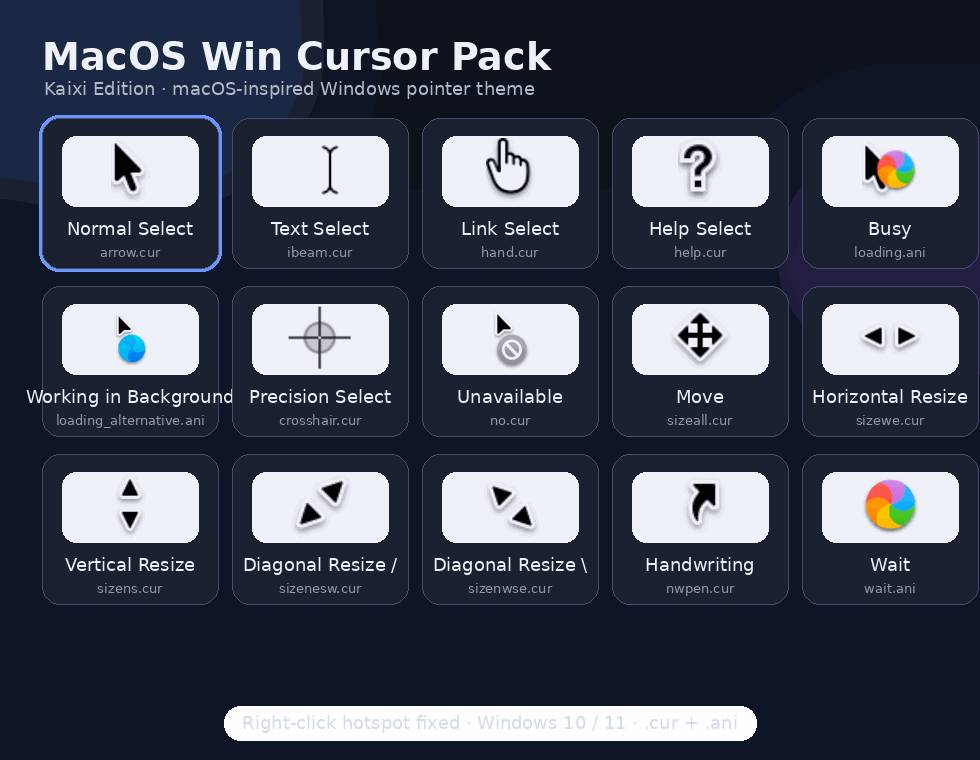

<div align="center">

#  MacOS Win Cursor Pack

**A macOS-inspired Windows cursor theme with polished hotspots, animated loading states, and full system pointer coverage.**




</div>

---

## Overview

**MacOS Win Cursor Pack — Kaixi Edition** is a clean, high-contrast cursor theme designed to bring a macOS-like pointer experience to Windows. The pack includes static `.cur` pointers and animated `.ani` loading cursors, covering the major Windows cursor roles from normal selection and text input to resizing, moving, unavailable states, and background activity.

This edition also focuses on practical usability: hotspot positioning has been adjusted to improve click accuracy, including the right-click alignment issue that commonly appears in cursor conversions.

## Highlights

- macOS-inspired pointer aesthetics for Windows
- Full cursor-role coverage for daily desktop use
- Animated busy, wait, and background-working cursors
- Right-click hotspot alignment fixed
- Lightweight native `.cur` and `.ani` files
- No external cursor manager required
- Suitable for Windows 10 and Windows 11

## Cursor Set

| Windows Role | Cursor File |
|---|---|
| Normal Select | `arrow.cur` |
| Text Select | `ibeam.cur` |
| Link Select | `hand.cur` |
| Help Select | `help.cur` |
| Busy | `loading.ani` |
| Working in Background | `loading_alternative.ani` |
| Precision Select | `crosshair.cur` |
| Unavailable | `no.cur` |
| Move | `sizeall.cur` |
| Horizontal Resize | `sizewe.cur` |
| Vertical Resize | `sizens.cur` |
| Diagonal Resize `/` | `sizenesw.cur` |
| Diagonal Resize `\` | `sizenwse.cur` |
| Handwriting | `nwpen.cur` |
| Wait | `wait.ani` |

## Installation

### Automatic installation

1. Download the latest release ZIP.
2. Extract the archive.
3. Right-click `Install.inf`.
4. Select **Install**.
5. Open Windows mouse settings and apply the installed cursor scheme.

```text
Settings → Bluetooth & devices → Mouse → Additional mouse settings → Pointers
```

### Manual installation

Copy all `.cur` and `.ani` files to:

```text
C:\Windows\Cursors\
```

Then open the Windows pointer settings panel and manually assign each cursor role.

## Compatibility

| Platform | Status |
|---|---|
| Windows 10 | Supported |
| Windows 11 | Supported |
| Windows on ARM | Untested |

## Repository Structure

```text
.
├── README.md
├── Install.inf
├── arrow.cur
├── hand.cur
├── loading.ani
├── wait.ani
├── ...
└── assets/
    └── cursor-showcase.gif
```

## Troubleshooting

If the cursor scheme does not appear after installation, restart Windows Explorer or reboot the system. Administrator permission may be required when installing through `Install.inf`. If another cursor manager is active, it may override the Windows pointer scheme.

## Release Package

For GitHub Releases, upload the ZIP archive containing `Install.inf`, all cursor files, and this README. Recommended tag format:

```text
v1.0.0
```

Recommended release title:

```text
MacOS Win Cursor Pack v1.0.0
```

## License

This cursor pack is intended for personal desktop customization. If you redistribute or modify it, retain attribution where appropriate.

